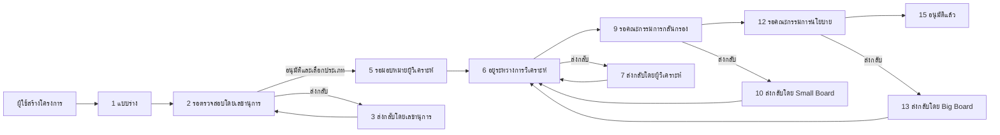

# Project Workflow และ Project Status

เอกสารนี้อธิบายขั้นตอนการใช้งานโครงการ ตั้งแต่การสร้างโครงการจนถึงการอนุมัติ
โดยอ้างอิงจาก Workflow และสิทธิ์ที่กำหนดในระบบปัจจุบัน

## ภาพรวมการทำงาน



## Project Status ทั้งหมด

| ID | Status | ความหมาย | ขั้นตอนถัดไป |
|---:|---|---|---|
| 1 | แบบร่าง | ผู้สร้างกำลังกรอกข้อมูล | เจ้าของแก้ไขและ Submit |
| 2 | รอตรวจสอบโดยเลขานุการ | ส่งโครงการให้ Secretary ตรวจ | Secretary อนุมัติ ส่งกลับ หรือปฏิเสธ |
| 3 | ส่งกลับโดยเลขานุการ | Secretary ขอให้แก้ไข | เจ้าของแก้ไขแล้วส่งกลับไปสถานะ 2 |
| 4 | ไม่อนุมัติโดยเลขานุการ | Secretary ปฏิเสธ | จบกระบวนการ |
| 5 | รอมอบหมายผู้วิเคราะห์ | ผ่าน Secretary แล้ว รอ Admin มอบหมาย | Admin เลือก Analyst |
| 6 | อยู่ระหว่างการวิเคราะห์ | Analyst กำลังตรวจและแก้ไขข้อมูล | Analyst อนุมัติ ส่งกลับ ปฏิเสธ หรือขอเปลี่ยนผู้รับผิดชอบ |
| 7 | ส่งกลับโดยผู้วิเคราะห์ | Analyst ขอให้เจ้าของแก้ไข | เจ้าของแก้ไขแล้วส่งกลับตรงไปสถานะ 6 |
| 8 | ไม่อนุมัติโดยผู้วิเคราะห์ | Analyst ปฏิเสธ | จบกระบวนการ |
| 9 | รอคณะกรรมการกลั่นกรอง | รอ Small Board พิจารณา | ไปสถานะ 12, 10 หรือ 11 |
| 10 | ส่งกลับโดย Small Board | Small Board ขอแก้ไข | เจ้าของแก้ไขแล้วกลับไปสถานะ 6 |
| 11 | ไม่อนุมัติโดย Small Board | Small Board ปฏิเสธ | จบกระบวนการ |
| 12 | รอคณะกรรมการนโยบาย | รอ Big Board พิจารณา | ไปสถานะ 15, 13 หรือ 14 |
| 13 | ส่งกลับโดย Big Board | Big Board ขอแก้ไข | เจ้าของแก้ไขแล้วกลับไปสถานะ 6 |
| 14 | ไม่อนุมัติโดย Big Board | Big Board ปฏิเสธ | จบกระบวนการ |
| 15 | อนุมัติแล้ว | โครงการผ่านการอนุมัติทั้งหมด | สถานะสุดท้าย |

## Flow ของ Project Owner

### การสร้างและแก้ไขโครงการ

ผู้ใช้สามารถสร้างโครงการใหม่และบันทึกข้อมูลเป็นแบบร่างได้ โดยโครงการจะเริ่มต้น
ที่สถานะ:

```text
1 — แบบร่าง
```

ผู้ใช้สามารถแก้ไขข้อมูลและ Proposal ในสถานะต่อไปนี้:

```text
1 แบบร่าง
3 ส่งกลับโดยเลขานุการ
7 ส่งกลับโดยผู้วิเคราะห์
10 ส่งกลับโดย Small Board
13 ส่งกลับโดย Big Board
```

เมื่อโครงการอยู่ในสถานะรอตรวจหรือกำลังพิจารณา ผู้ใช้จะไม่สามารถแก้ไขข้อมูลได้
จนกว่าจะได้รับการส่งกลับ

### การ Submit โครงการ

การ Submit จะเปลี่ยนสถานะดังนี้:

```text
1  → 2    แบบร่าง → รอตรวจสอบโดยเลขานุการ
3  → 2    ส่งกลับโดยเลขานุการ → รอตรวจสอบโดยเลขานุการ
7  → 6    ส่งกลับโดย Analyst → อยู่ระหว่างการวิเคราะห์
10 → 6    ส่งกลับโดย Small Board → อยู่ระหว่างการวิเคราะห์
13 → 6    ส่งกลับโดย Big Board → อยู่ระหว่างการวิเคราะห์
```

โครงการที่ถูกส่งกลับจาก Analyst หรือ Board จะกลับไปหา Analyst โดยตรง
ไม่ต้องผ่าน Admin assignment ใหม่

### Multi-role Submission

สิทธิ์การ Submit เป็นแบบ Additive หากผู้ใช้มีหลาย Role:

```text
secretary + user       Submit ได้ หากเป็นเจ้าของโครงการ
secretary + admin      Submit ได้ หากเป็นเจ้าของโครงการ
secretary เท่านั้น     Submit ไม่ได้
```

นอกจาก Role แล้ว ผู้ใช้ต้องเป็นเจ้าของโครงการและโครงการต้องอยู่ในสถานะที่แก้ไขได้

## Flow ของ Secretary

หน้าใช้งาน:

```text
/tasks/screening
```

Secretary จะเห็นโครงการทั้งหมดจากทุก Department ที่อยู่สถานะ 2

Secretary สามารถเลือกได้ 3 รูปแบบ:

| การตัดสินใจ | ข้อมูลที่ต้องกรอก | Transition |
|---|---|---|
| Approve | เลือก Project Type เป็น Hardware หรือ Software | 2 → 5 |
| Return | Remark/เหตุผลที่ต้องแก้ไข | 2 → 3 |
| Reject | Remark/เหตุผลที่ปฏิเสธ | 2 → 4 |

เมื่อ Return ระบบจะแสดง Feedback ล่าสุดให้ Project Owner เห็นใน Workspace

Secretary สามารถแก้ไขรายละเอียดโครงการ Proposal และ Attachment ได้ตาม Server
permission แต่การเปลี่ยน Workflow Status ต้องใช้ Secretary Review endpoint
โดยเฉพาะ

## Flow ของ Admin และ Super Admin

หน้าใช้งาน:

```text
/tasks/assignment
```

Admin และ Super Admin จะเห็นโครงการที่ผ่าน Secretary แล้วและอยู่สถานะ 5

ขั้นตอนการ Assign:

1. เลือกโครงการ
2. ดูรายชื่อ Analyst ที่ Active
3. ตรวจสอบจำนวนงานปัจจุบันของ Analyst
4. เลือก Analyst
5. Assign โครงการ

ระบบจะบันทึกข้อมูล:

```text
analystId
assignedBy
assignedAt
```

และเปลี่ยนสถานะ:

```text
5 → 6
รอมอบหมายผู้วิเคราะห์ → อยู่ระหว่างการวิเคราะห์
```

รองรับทั้งการ Assign ทีละโครงการและ Bulk Assign หลายโครงการ

## Flow ของ Analyst

หน้าใช้งาน:

```text
/tasks/analyst
```

Analyst จะเห็นเฉพาะโครงการที่ `analystId` ตรงกับ User ID ของตนเอง

### สิทธิ์ระหว่างวิเคราะห์

เมื่อโครงการอยู่สถานะ 6 Analyst สามารถ:

- แก้ไข Project Details
- แก้ไข Proposal
- Upload Attachment
- Request Reassignment
- Approve, Return หรือ Reject โครงการ

Analyst ไม่สามารถ:

- ลบโครงการ
- ลบ Proposal
- ลบ Attachment
- เปลี่ยน Project Owner

### Request Reassignment

Analyst ต้องกรอกเหตุผล แล้วระบบจะ:

```text
ล้าง analystId
ล้าง assignedBy
ล้าง assignedAt
เปลี่ยนสถานะ 6 → 5
บันทึกเหตุผลลง project_status_logs
```

### Analyst Decision

ทุกการตัดสินใจต้องมี Remark ที่ไม่ใช่ค่าว่าง:

| การตัดสินใจ | Transition | ผลลัพธ์ |
|---|---|---|
| Approve | 6 → 9 | ส่งต่อ Small Board |
| Return | 6 → 7 | ส่งกลับให้เจ้าของแก้ไข |
| Reject | 6 → 8 | จบกระบวนการ |

เมื่อเจ้าของแก้ไขโครงการสถานะ 7 และ Submit ใหม่ ระบบจะเปลี่ยน:

```text
7 → 6
```

โครงการจะกลับไปยัง Analyst เดิมโดยตรง

## Flow ของ Small Board

Small Board พิจารณาโครงการสถานะ 9 ผ่านระบบ Meeting และ Resolution

```text
9 → 12    ผ่านการพิจารณา ส่งต่อ Big Board
9 → 10    ส่งกลับให้แก้ไข
9 → 11    ปฏิเสธ
```

หากส่งกลับ สถานะ 10 จะให้เจ้าของแก้ไขและ Submit กลับไปสถานะ 6

## Flow ของ Big Board

Big Board พิจารณาโครงการสถานะ 12 ผ่านระบบ Meeting และ Resolution

```text
12 → 15   อนุมัติโครงการ
12 → 13   ส่งกลับให้แก้ไข
12 → 14   ปฏิเสธ
```

หากส่งกลับ สถานะ 13 จะให้เจ้าของแก้ไขและ Submit กลับไปสถานะ 6

## สถานะที่จบกระบวนการ

สถานะต่อไปนี้ถือเป็นสถานะปฏิเสธและไม่สามารถดำเนิน Workflow ต่อได้:

```text
4  ไม่อนุมัติโดยเลขานุการ
8  ไม่อนุมัติโดยผู้วิเคราะห์
11 ไม่อนุมัติโดย Small Board
14 ไม่อนุมัติโดย Big Board
```

สถานะ 15 คือสถานะอนุมัติสุดท้าย:

```text
15 — อนุมัติแล้ว
```

## Audit Log และความปลอดภัย

ทุกการเปลี่ยนสถานะต้องผ่าน Workflow helper กลางของ Backend ได้แก่
`assertValidProjectTransition` และ `applyProjectStatusTransition`

ระบบจะบันทึกลง `project_status_logs` ได้แก่:

- Project ID
- ผู้ดำเนินการ
- สถานะเดิม
- สถานะใหม่
- Remark หรือเหตุผล
- วันที่และเวลา

หากมีผู้ใช้อื่นเปลี่ยนสถานะไปก่อน ระบบจะปฏิเสธคำขอด้วย `409 Conflict`
เพื่อป้องกันการ Review โครงการซ้ำหรือใช้ข้อมูลเก่า

## สรุปลำดับหลัก

```text
User สร้างโครงการ
  ↓
Draft (1)
  ↓ Submit
Pending Secretary (2)
  ↓ Secretary Approve
Pending Assignment (5)
  ↓ Admin Assign Analyst
In Analysis (6)
  ↓ Analyst Approve
Pending Small Board (9)
  ↓ Small Board Approve
Pending Big Board (12)
  ↓ Big Board Approve
Approved (15)
```

